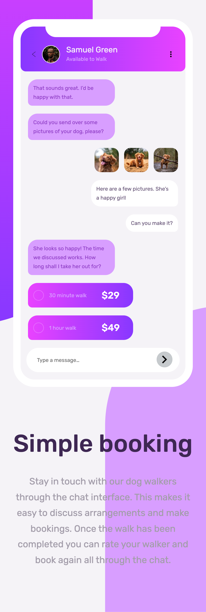

# Frontend Mentor - Chat app CSS illustration solution

This is a solution to the [Chat app CSS illustration challenge on Frontend Mentor](https://www.frontendmentor.io/challenges/chat-app-css-illustration-O5auMkFqY). Frontend Mentor challenges help you improve your coding skills by building realistic projects.

## Table of contents

- [Overview](#overview)
  - [The challenge](#the-challenge)
  - [Screenshot](#screenshot)
  - [Links](#links)
- [My process](#my-process)
  - [Built with](#built-with)
  - [What I learned](#what-i-learned)
  - [Continued development](#continued-development)
  - [Useful resources](#useful-resources)
- [Author](#author)
- [Acknowledgments](#acknowledgments)

## Overview

This is _16th project_ from "Frontend Mentor" to sharpen HTML & CSS skills along with responsive web design and it's build with "BEM", "Grid & Flexbox layout", "min-width, max-width, width in various units, icon / image placements & with help of Google ofcourse".

This is most complex project from Frontend Mentor's HTML and CSS set of projects, I took 2.3 md to complete the same.

You can see the commit history to see the approach I've followed to solve this most complex project.

### The challenge

Users should be able to:

- View the optimal layout for the component depending on their device's screen size
- **Bonus**: See the chat interface animate on the initial load

### Screenshot

### Links

- [Live Website](https://vikramvi.github.io/Chat-app-CSS-illustration/)

## My process

### Built with

- Love, Passion & Commitment
- Semantic HTML5 markup
- BEM
- Mobile-first workflow
- CSS Grid
- Flexbox
- min-width, max-width & width in various units
- Chrome and FF Dev Tools
- Googling

### What I learned

- It helps to break down big problem into smallest possible and start solving those small problems one by one
- ".. You just begin. You do the math. You solve one problem... and you solve the next one... and then the next. And If you solve enough problems, you get to come home. ..."
- Improving Googling techniques
- Better dev tool usage on both FF and Chrome
- Better debugging
- Different problem solving techniques

### Continued development

- Learn more about better practices wrt below

  - Grid, Flexbox layouts
  - Mobile layout designs
  - width, max-width, min-width good practices
  - padding, margin good practices
  - SEO and Accessibility practices
  - BEM
  - Responsive Web Design optimum techniques

### Useful resources

- Frontend Mentor slack community + website
- YT videos
- Google
- Stackoverflow

## Author

- Frontend Mentor - [@vikramvi](https://www.frontendmentor.io/profile/vikramvi)

## Acknowledgments

- Frontend Mentor slack community
- YT content creators
- Google + SO community
